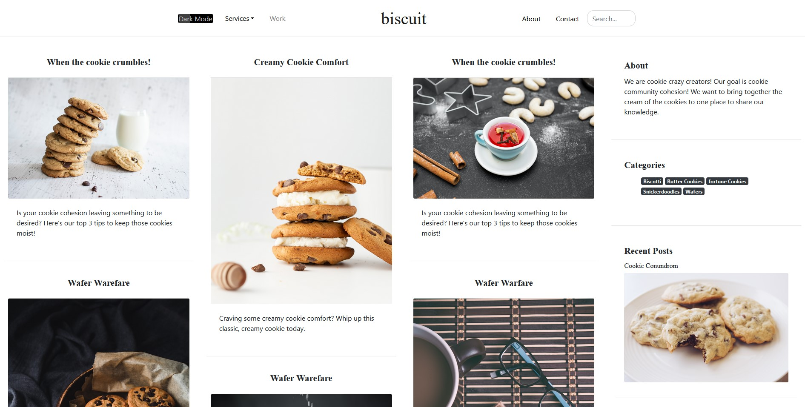
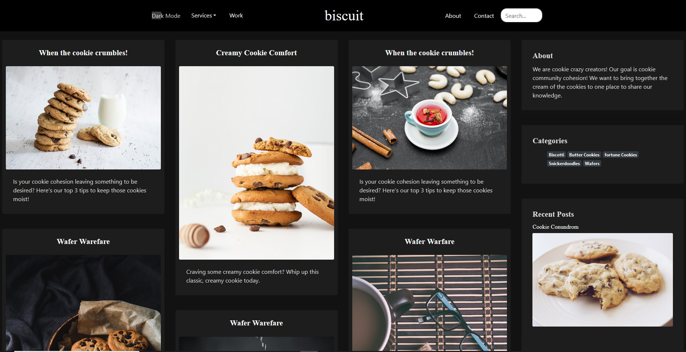

# ARCHIVE - Biscuit Blog

Simple grid style blog site

|   |   |
|---|---|


## Introduction 

I created this as a way to practice Bootstrap 4 and become more comfortable laying out a blog/magazine site.

### Features

* Grid Style Layout
* Dark Mode
* Responsive Design
* Dynamic read time calculator for blog posts

### Technologies

* Bootstrap 4
* Webpack 4
* Vanilla JavaScript
* Countable Library 
* jQuery

### Installation 

This app requires [Node.js](https://node.js.org/) v14.4.0 to run

Install the dependecies

```sh
$ npm install
```

Start the dev server

```sh
$ cd biscuit_blog
$ npm run serve
```

For production build

```sh
npm run build
```

### Sources 

This site was largerly inspired by the Milo - Magazine/Blog Theme by the Bootlab team. [@Bootlab](https://themes.getbootstrap.com/store/bootlab/)
